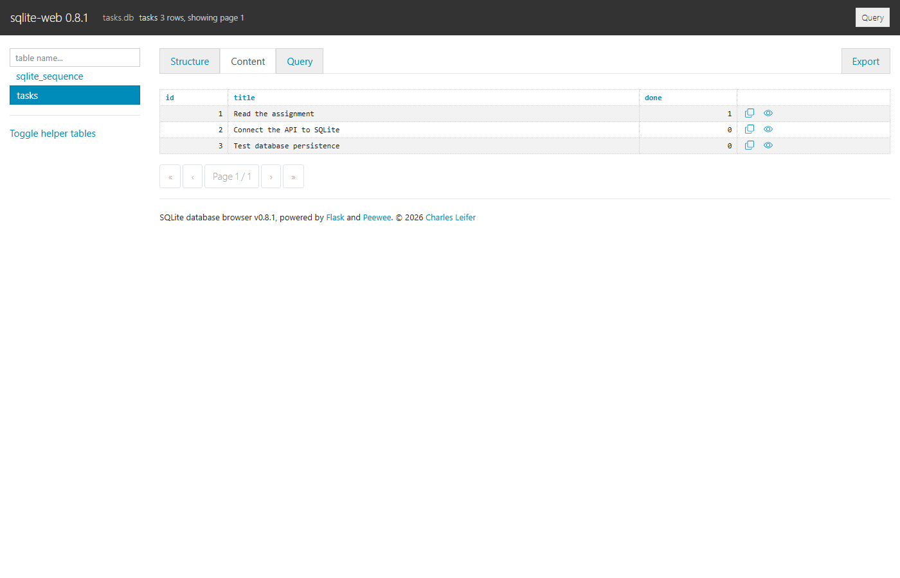

# Task API - SQLite Persistence

This is my Week 3 assignment for the FlyRank Backend Track. It is a FastAPI CRUD API that stores tasks in a real SQLite database, so the data remains available after the server restarts.

## Why I chose SQLite

SQLite is a good fit for this assignment because it stores the whole database in one file, needs no separate database server, and requires almost no setup. The application creates `tasks.db` automatically in the project root. The file is listed in `.gitignore`, so a clean clone creates its own fresh database when the app first starts.

## How it works

Project post: https://www.linkedin.com/posts/md-tamjid-hossain-0597082bb_ai-claude-flyrank-activity-7507452832401297408-tTJq?utm_source=share&utm_medium=member_desktop&rcm=ACoAAEzQOkUBtIV2EbRCsHYnuS3MOHh4OV_wkvk

- Stores every task in a SQLite `tasks` table.
- Added automatic database and table creation.
- Added three seed tasks only when the table is empty.
- Uses parameterized `SELECT`, `INSERT`, `UPDATE`, and `DELETE` queries.
- Provides the required CRUD endpoints, validation rules, JSON responses, and status codes.
- Added tests for persistence, safe parameter binding, and seed duplication.

## Database schema

The `tasks` table contains exactly three columns:

| Column | SQLite type | Purpose |
| --- | --- | --- |
| `id` | `INTEGER PRIMARY KEY AUTOINCREMENT` | Unique ID assigned by SQLite |
| `title` | `TEXT NOT NULL` | Task description |
| `done` | `INTEGER NOT NULL DEFAULT 0` | Boolean value stored as `0` or `1` |

On the first run, the application inserts these three examples:

1. Read the assignment
2. Connect the API to SQLite
3. Test database persistence

Before seeding, the program runs `SELECT COUNT(*) FROM tasks`. It inserts the examples only when the result is zero, so restarting the server does not create duplicates.

## Project structure

```text
Backend_Assignment_SQLite_Task_API/
├── app/
│   ├── __init__.py
│   └── main.py
├── docs/
│   ├── api-evidence.txt
│   ├── database-content.png
│   ├── stage4-sql.txt
│   └── test-results.txt
├── tests/
│   └── test_api.py
├── .gitignore
├── README.md
├── requirements.txt
└── requirements-dev.txt
```

`tasks.db` is generated automatically after the application is imported or started.

## Install and run

Python 3.10 or newer is required.

Create a virtual environment and install the application packages:

```powershell
python -m venv .venv
.\.venv\Scripts\python.exe -m pip install -r requirements.txt
```

Start the project with this command:

```powershell
.\.venv\Scripts\python.exe -m uvicorn app.main:app --reload
```

The API runs at `http://127.0.0.1:8000`.

- Swagger UI: `http://127.0.0.1:8000/docs`
- Health check: `http://127.0.0.1:8000/health`
- Task list: `http://127.0.0.1:8000/tasks`

## Required endpoints

| Method | Path | Purpose | Success status |
| --- | --- | --- | --- |
| `GET` | `/tasks` | List all tasks | `200` |
| `GET` | `/tasks/{task_id}` | Get one task | `200` |
| `POST` | `/tasks` | Create a task | `201` |
| `PUT` | `/tasks/{task_id}` | Update a task | `200` |
| `DELETE` | `/tasks/{task_id}` | Delete a task | `204` |

## Request examples

Create a task:

```json
{
  "title": "Buy milk"
}
```

Update a task:

```json
{
  "title": "Buy milk today",
  "done": true
}
```

## Validation and errors

| Situation | Status | Response |
| --- | --- | --- |
| Missing or empty POST title | `400` | JSON error message |
| Empty or invalid PUT body | `400` | JSON error message |
| Unknown task ID | `404` | `{"error":"Task not found"}` |
| Successful delete | `204` | Empty response body |

All values received from a request are passed separately from the SQL text with `?` placeholders. User input is never joined directly into a SQL query.

## Persistence proof

I created a task with `POST /tasks`, closed the connection, and opened the same `tasks.db` file through a fresh SQLite connection. The new row was still present. The automated test `test_created_task_survives_a_fresh_database_connection` repeats this check.

The initialization tests also start the same database three times and confirm that the seed count remains three.

I also verified a real restart from a clean copy of the repository: I created a task named `Restart proof`, stopped Uvicorn, started it again, and `GET /tasks/4` returned `200 OK` with the same saved task.

I also ran the complete CRUD cycle with `curl -i`. The real HTTP status lines and JSON responses are saved in [`docs/api-evidence.txt`](docs/api-evidence.txt).

## Stage 4 SQL query

I ran this query against `tasks.db`:

```sql
SELECT COUNT(*) FROM tasks;
```

It returned `3` because the clean database contained the three seeded tasks. The recorded query and result are saved in [`docs/stage4-sql.txt`](docs/stage4-sql.txt).

I ran all five Stage 4 queries in the browser query tab against a disposable copy of `tasks.db`. The copy was used so the submitted database evidence could still show the original three seed rows.

## Database inspection

I opened the actual `tasks.db` file in a read-only SQLite database browser and captured its live **Content** view. It shows the same three rows returned by `GET /tasks`.



## Run the tests

Install the development packages and run the complete test suite:

```powershell
.\.venv\Scripts\python.exe -m pip install -r requirements-dev.txt
.\.venv\Scripts\python.exe -m pytest -q
```

The final run completed with all 19 tests passing. The suite checks automatic creation, seed protection, all CRUD endpoints, persistence, validation, status codes, JSON errors, parameterized title handling, OpenAPI responses, and the empty `204` delete response.

The same endpoint, status-code, validation, and JSON-shape checks that worked for the in-memory API also pass with SQLite. That proves the database is an implementation detail: clients use the same API contract even though the storage layer changed.

## Clean-clone behaviour

If `tasks.db` does not exist, starting the application creates the file, creates the `tasks` table, and inserts the three seed tasks. No manual database setup is required.

## Author

Md. Tamjid Hossain

FlyRank AI Internship - Backend Track, Week 3
